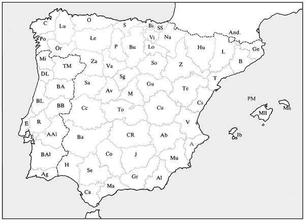
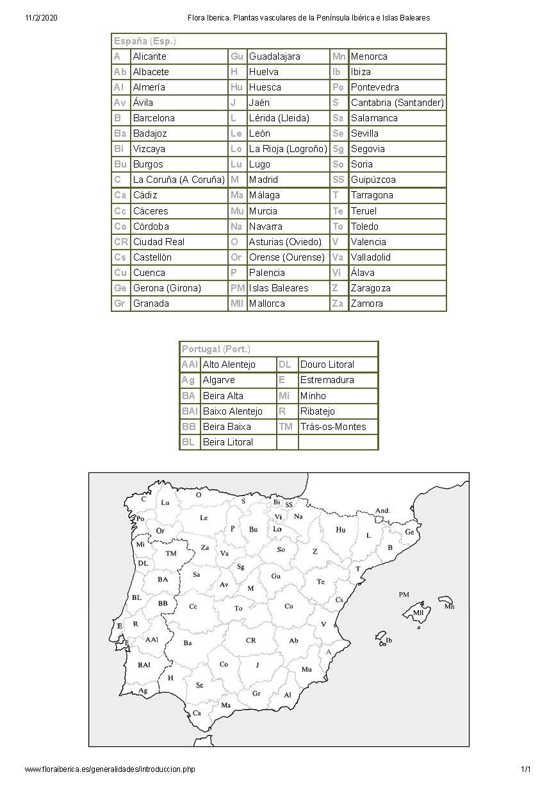
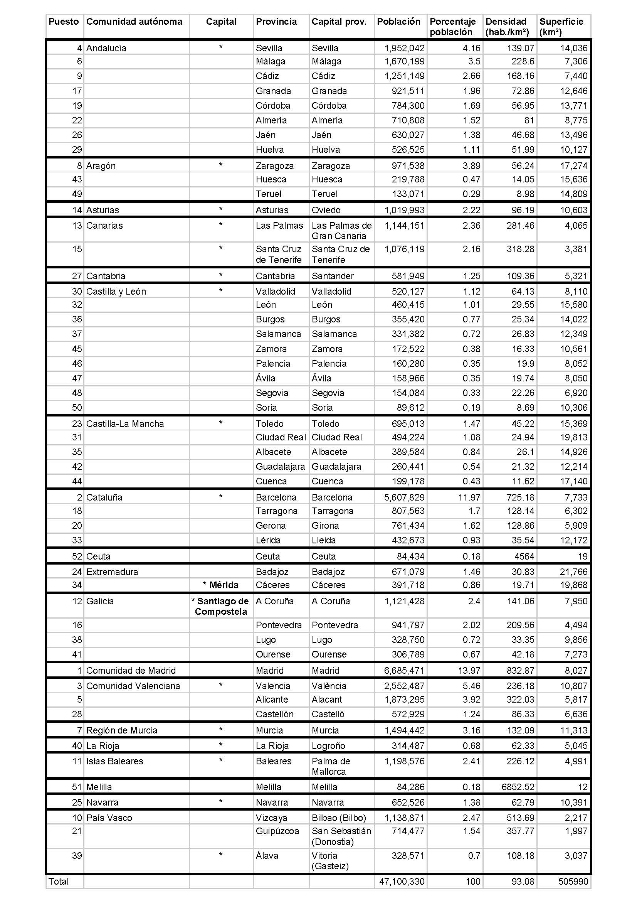

# Xeografía:

##Mapas:

[Galicia físico](./Galiciafisico.jpg) | [provincias ibéricas](./Provincias_ibericas.jpg) | [datos Flora Ibérica JPEG](./Flora Iberica. Provincias.jpg) | [datos provincias ibéricas JPEG](./Provincias_datos.jpg)

##tests:
[local mapquiz](./mapquiz.htm)

##xeografía histórica:
[historical-basemaps](https://github.com/aourednik/historical-basemaps) by aourednik
[interactive World History Atlas since 3000 BC](http://geacron.com/home-en/)